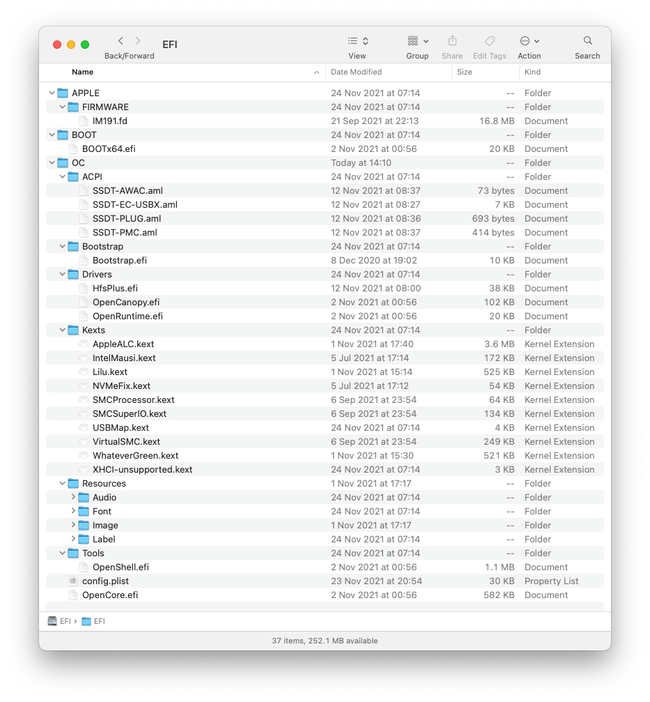
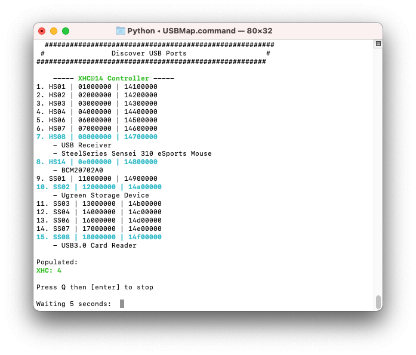
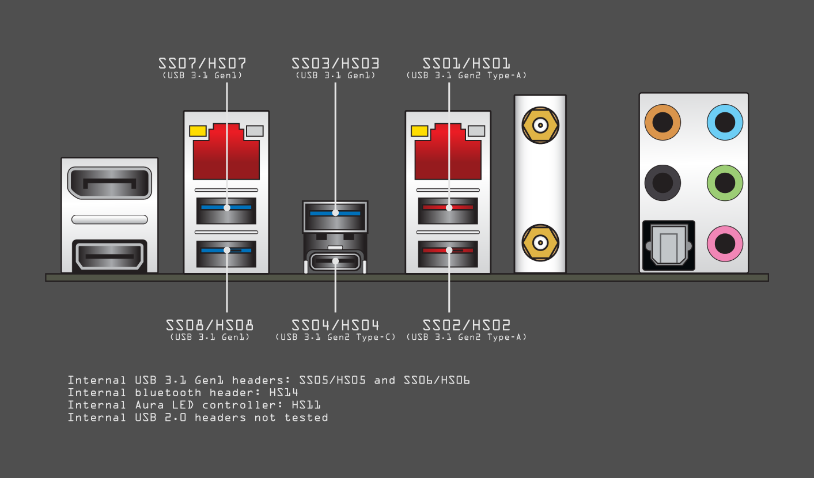

# Asus ROG STRIX H370-I GAMING Hackintosh Guide

## December 2021 update
The PowerColor Radeon RX 5700 XT 8 GB Red Dragon was causing too many system lockups (seems to be related to using dual monitors) so I'm back to the Intel UHD Graphics 630. At the same time I updated to OpenCore 0.7.5 in preparation for Monterey.

## My system
* CPU: Intel Core i7-8700K
* CPU cooler: Noctua NH-L9i chromax.black
* Motherboard: Asus ROG Strix H370-I Gaming
* Memory: Corsair Vengeance LPX 16 GB (2 x 8 GB) DDR4-3200
* Storage: 2 x Samsung 970 Evo Plus 500 GB M.2-2280 NVME Solid State Drive
* Graphics: Intel UHD Graphics 630
* Case: DAN Cases A4-SFXv4.1
* Power supply: Corsair SF 600W 80+ Platinum

## OpenCore guide
I followed the [*Dortania*](https://dortania.github.io/OpenCore-Install-Guide/) guide step-by-step; as I'm new to OpenCore I'll only add a few comments.

## PlatformInfo
I'm using an *iMac19,1* SMBIOS

## Kexts, drivers etc


## USB 15 port limit


- I generated a *USBMap.kext*

## Audio
- the audio layout id is 7; the preferred method now seems to be to use *alcid* in *boot-args*, so I have `alcid=7`

## Issues
### RTC/CMOS error
- on restart I was getting the BIOS error *The system has posted in safe mode*. This is fxed with *DisableRtcChecksum* in *Kernal* -> *Quirks* set to *true*:
```
			<key>DisableRtcChecksum</key>
			<true/>
```
### Intel UHD Graphics 630 and dual monitors
- my primary monitor is on the Display Port and secondary is on HDMI
- I have the following in *DeviceProperties* to get dual monitor working, but I still have to power-cycle the second monitor after booting or waking from sleep:
```
			<key>PciRoot(0x0)/Pci(0x2,0x0)</key>
			<dict>
				<key>AAPL,ig-platform-id</key>
				<data>BwCbPg==</data>
				<key>framebuffer-patch-enable</key>
				<data>AQAAAA==</data>
				<key>framebuffer-stolenmem</key>
				<data>AAAwAQ==</data>
				<key>framebuffer-con1-enable</key>
				<data>AQAAAA==</data>
				<key>framebuffer-con1-type</key>
				<data>AAgAAA==</data>
				<key>framebuffer-con1-pipe</key>
				<data>CAAAAA==</data>
				<key>framebuffer-con1-busid</key>
				<data>AgAAAA==</data>
				<key>framebuffer-con2-enable</key>
				<data>AQAAAA==</data>
				<key>framebuffer-con2-index</key>
				<data>/////w==</data>
				<key>framebuffer-portcount</key>
				<data>AgAAAA==</data>
				<key>framebuffer-pipecount</key>
				<data>AgAAAA==</data>
			</dict>
```


